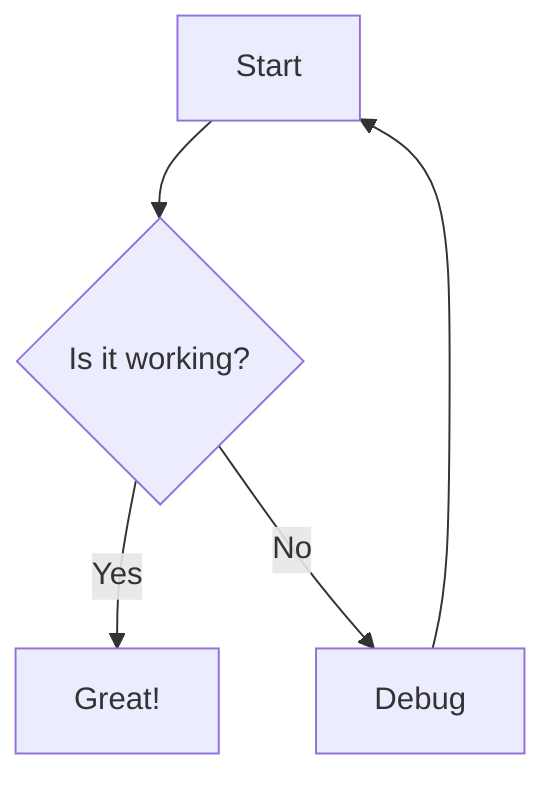

# Markdown Plugin Test File

This file tests all the markdown editing features installed.

## Testing Checklist

- [ ] Syntax highlighting works
- [ ] Folding works (try `zc` on headings)
- [ ] Preview opens (`<leader>mp`)
- [ ] Table mode works (`<leader>mt`)
- [ ] Checkbox toggle works (`<leader>mc`)
- [ ] Link following works (`gx`)

## Heading Navigation Test

### Level 3 Heading 1

Press `]]` to jump to next heading.

### Level 3 Heading 2

Press `[[` to jump to previous heading.

### Level 3 Heading 3

Press `]c` to jump to current heading's start.

## Link Test

Test link following with `gx`:

- [GitHub](https://github.com)
- [Google](https://google.com)
- Internal link: [[other-file]]

## Table Mode Test

Press `<leader>mt` to enable table mode, then type this:

| Feature | Status  | Notes         |
| ------- | ------- | ------------- |
| Preview | Working | Opens browser |
| Tables  | Working | Auto-aligns   |
| Folding | Working | By heading    |

To create a new table:

1. Press `<leader>mt` to enable table mode
2. Type `|` to start a new row
3. Type content and press `|` to move to next cell
4. Press `||` to add header separator

## Checkbox Test

Task list (press `<leader>mc` to toggle):

- [ ] First task
- [x] Completed task
- [ ] Another pending task
- [ ] One more task

## Math Test (KaTeX in Preview)

Inline math: $E = mc^2$

Block math:

$$
\int_{-\infty}^{\infty} e^{-x^2} dx = \sqrt{\pi}
$$

## Mermaid Diagram Test



## Code Blocks

```python
def hello_markdown():
    print("Markdown editing is awesome!")
    return True
```

```javascript
const testMarkdown = () => {
  console.log("Testing markdown plugins!");
  return "success";
};
```

## Bold, Italic, Strikethrough

- **Bold text** (try `gs` to toggle)
- _Italic text_ (try `gs` to toggle)
- **_Bold and italic_**
- ~~Strikethrough~~

## List Test

Ordered list:

1. First item
2. Second item
   1. Nested item
   2. Another nested item
3. Third item

Unordered list:

- Item one
- Item two
  - Nested item
  - Another nested
- Item three

## Blockquote

> This is a blockquote.
> It can span multiple lines.
>
> > And can be nested too!

## Horizontal Rule

---

## Frontmatter Test

This file has no frontmatter, but vim-markdown supports:

- YAML frontmatter
- TOML frontmatter
- JSON frontmatter

Example:

```yaml
---
title: My Document
author: Gabriel
date: 2026-01-24
tags: [markdown, neovim, testing]
---
```

## Folding Test

Try these fold commands:

- `zc` - Close fold under cursor
- `zo` - Open fold under cursor
- `za` - Toggle fold under cursor
- `zR` - Open all folds
- `zM` - Close all folds

## Preview Features

When you press `<leader>mp`, the preview should show:

- ✅ Rendered markdown
- ✅ Math equations (KaTeX)
- ✅ Mermaid diagrams
- ✅ Syntax highlighted code blocks
- ✅ Dark theme
- ✅ Synchronized scrolling

## Plugin-Specific Commands

### markdown.nvim Commands

- `:MDListItemBelow` - Create new list item
- `:MDTaskToggle` - Toggle checkbox
- Navigation: `]]`, `[[`, `]c`, `]p`

### vim-markdown Commands

- `:Toc` - Open table of contents
- `:InsertToc` - Insert table of contents at cursor
- `:InsertNToc` - Insert numbered table of contents

### vim-table-mode Commands

- `:TableModeToggle` - Toggle table mode
- `:TableModeRealign` - Realign current table
- `:Tableize` - Convert CSV to table

## Expected Results

After testing, all features should work:

1. ✅ Syntax highlighting visible
2. ✅ Headings fold/unfold smoothly
3. ✅ Preview opens in browser
4. ✅ Tables auto-format when typing
5. ✅ Checkboxes toggle with `<leader>mc`
6. ✅ Links open with `gx`
7. ✅ Navigation with `]]` and `[[` works
8. ✅ Math renders in preview
9. ✅ Diagrams render in preview

---

## Notes

This is a comprehensive test file covering all features of the installed plugins:

- markdown-preview.nvim
- markdown.nvim
- vim-table-mode
- vim-markdown

Happy markdown editing! 🎉
